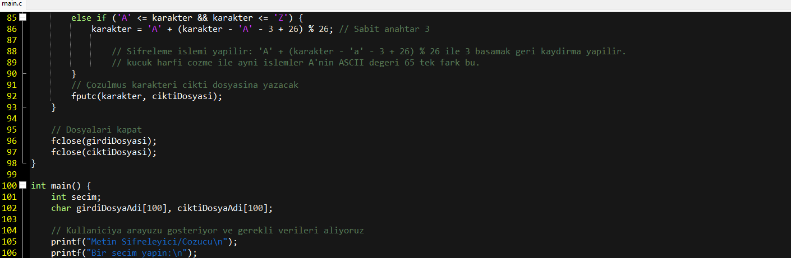
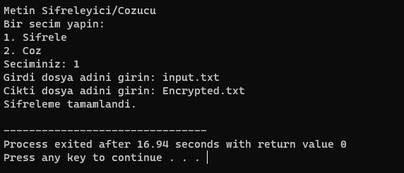
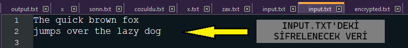
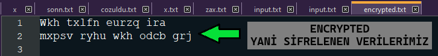

# algoritmaodevi1.2

# Şifreleme/Şifre Çözme Uygulaması

Bu uygulama, verilen bir metni belirli bir anahtar değeri ile şifreleyen ve aynı anahtar değeri ile şifresini çözen bir şifreleme algoritmasını içerir.
Şuan ki halinde şifreleme için sabit anahtar değeri '3'. Fakat bu sabit anahtar değeri isteğinize göre değiştirmekte özgürsünüz!

## Şifreleme Algoritması

Algoritma, her bir karakterin ASCII değerine dayanarak çalışır. Bir karakterin şifrelenmiş hali, karakterin ASCII değeri ve belirli bir anahtar değerinin toplamıdır. Anahtarımız (Sabit) ise 3'dür. Yani her bir karakter şifrelenirken kendinden sonraki 3. harfe denk getirilir. Şifre çözülürken de anahtarımız sabit olduğundan her karakter kendinden önceki 3.harfe denk getirilir. Şifreyi çözmek için ise şifrelenmiş karakterden anahtar değeri çıkartılarak orijinal karakter elde edilir. Uygulama yalnızca İngilizce alfabe üzerinde çalışmaktadır.

## Kullanım

Uygulama iki temel işlemi gerçekleştirir: şifreleme ve şifre çözme. Anahtar değeri kullanıcı tarafından belirlenir ve her iki işlemde de aynı anahtar kullanılır. Biz anahtar değeri olarak 3'ü kullandık.

### Şifreleme
Bu komut, `input.txt` dosyasındaki metni 3 birim kaydırarak şifreler ve sonucu `encrypted.txt` dosyasına kaydeder.

### Şifre Çözme
Bu komut, `encrypted.txt` dosyasındaki şifreli metni 3 birim geri kaydırarak çözer ve sonucu `decrypted.txt` dosyasına kaydeder.

## Örnek Kullanım

Gerekenler:

-- DEV C++

-- main.c Dosyası

### Şifreleme İçin:

Adım 1:
Main.C Dosyamızı DEV C++ ile Açıp F11 Tuşu İle Compile & Run Ediyoruz.

Adım 2:
Şifreleme Yapmak İçin 1'İ Seçip Dosya Adlarımızı Giriyoruz.
Örnekte Yapacağımız Üzere Verilerimiz İnput.txt de Olacağından Girdi Dosyası İnput.txt
Şifrelenmiş Çıktıyı ise Encryptex.txt Olarak Oluşturmasını İstiyoruz.

### Girdi (Veri)

Girilen İnput Yani Sifrelenecek Veri:

### Çıktı (Şifrelenmiş Veri)

İşlem Sonucunda Oluşturulan Encrypted.txt Yani Şifrelenmiş Veri:

