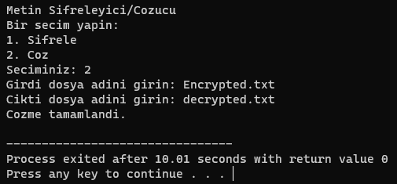
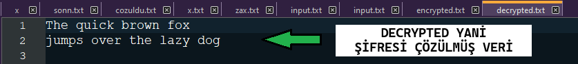

# algoritmaodevi1.2

# Şifreleme/Şifre Çözme Uygulaması

Bu uygulama, verilen bir metni belirli bir anahtar değeri ile şifreleyen (Örneğin 5 Anahtar Değeri İçin Metindeki Her Bir Harfi 5 İleri Öteleyen) ve aynı anahtar değeri ile şifresini çözen bir şifreleme algoritmasını içerir.
Şuan ki halinde şifreleme için sabit anahtar değeri '3'. Fakat bu sabit anahtar değeri isteğinize göre değiştirebilirsiniz.

## Şifreleme Algoritması

Algoritma, her bir karakterin ASCII değerine dayanarak çalışır. Bir karakterin şifrelenmiş hali, karakterin ASCII değeri ve belirli bir anahtar değerinin toplamıdır. Anahtarımız (Sabit) ise 3'dür. Yani her bir karakter şifrelenirken kendinden sonraki 3. harfe denk getirilir. Şifre çözülürken de anahtarımız sabit olduğundan her karakter kendinden önceki 3.harfe denk getirilir. Şifreyi çözmek için ise şifrelenmiş karakterden anahtar değeri çıkartılarak orijinal karakter elde edilir. Uygulama yalnızca İngilizce alfabe üzerinde çalışmaktadır.

## Kullanım

Uygulama iki temel işlemi gerçekleştirir: şifreleme ve şifre çözme. Anahtar değeri kullanıcı tarafından belirlenir ve her iki işlemde de aynı anahtar kullanılır. Biz anahtar değeri olarak 3'ü kullandık.

### Şifreleme
Bu komut, herhangi bir `input.txt` dosyasındaki metnin içeriğini 3 birim ileri kaydırarak şifreler ve sonucu `encrypted.txt` dosyasına kaydeder.

### Şifre Çözme
Bu komut, `encrypted.txt` dosyasındaki şifreli metnin içeriğini 3 birim geri kaydırarak çözer ve sonucu `decrypted.txt` dosyasına kaydeder.

## Örnek Kullanım

Gerekenler:

-- DEV C++ (SourceForge Üzerinden İndirebilirsiniz.)

-- main.c Dosyası (Proje Üzerinden İndiriniz.)

-- Sifreleyeceginiz veya Sifresini Cozeceginiz .txt Dosyasi

### Şifreleme İçin:

**Adım 1:**
Main.C Dosyamızı DEV C++ ile Açıp F11 Tuşu İle Compile & Run Ediyoruz.

**Adım 2:**
Şifreleme Yapmak İçin 1'İ Seçip Dosya Adlarımızı Giriyoruz.
Örnekte Yapacağımız Üzere Verilerimiz İnput.txt de Olacağından Girdi Dosyası İnput.txt
Şifrelenmiş Çıktıyı ise Encrypted.txt Olarak Oluşturmasını İstiyoruz.

>_📄Dipnot: Dosyanınızın adının input.txt olması şart değil. Örneğin; elinizde deneme.txt diye bir dosya vardır, bunu main.c dosyasının olduğu klasöre atarsınız ve girdi dosyası kısmına deneme.txt yazıp o metin belgesini istediğiniz işleme sokabilirsiniz._

### Girdi (Veri)

Girilen İnput Yani Sifrelenecek Veri:

### Çıktı (Şifrelenmiş Veri)

Şifreleme İşlemi Sonucunda Oluşturulan Encrypted.txt Yani Şifrelenmiş Veri:

### Şifreyi Çözmek İçin

**Adım 1:**
Main.C Dosyamızı DEV C++ ile Açıp F11 Tuşu İle Compile & Run Ediyoruz.

**Adım 2:**
Şifreli verinin şifresini çözmek için 2'yi seçiyoruz.
Örneğimizde şifrelenmiş veri Encrypted.txt idi girdi dosyasına bunu giriyoruz.
Çıktı Dosya adına ise decrypted.txt dedik. (Dosya adı hakkındaki dipnot burada da geçerli, istediğiniz dosyayı ve dosya adını girebilirsiniz.)
Artık Program Şifrelenmiş Verideki Şifreyi Çözebilir.

### Girdi (Şifreli Veri)

Girilen Yani Şifreli Veri:

### Çıktı (Şifresi Çözülmüş Veri)

Şifre Çözme İşlemi Sonucunda Oluştan decrypted.txt Yani Şifresi Çözülmüş Veri:

